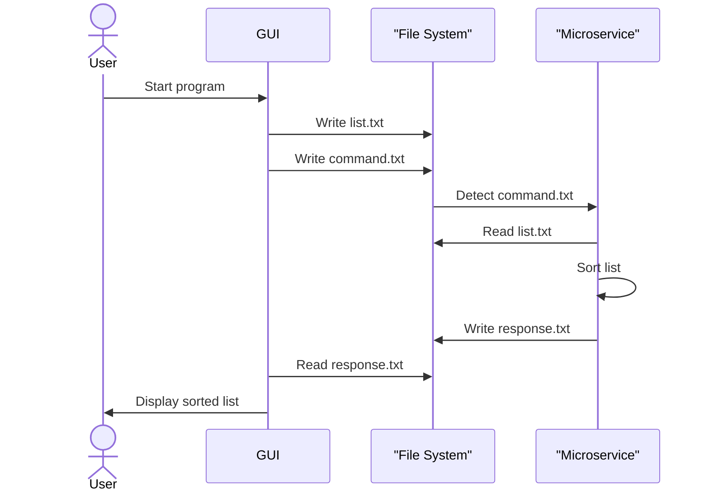

# Sort Microservice – Communication Contract

This microservice sorts a list of items either in **ascending (A–Z)** or **descending (Z–A)** order using a simple text file communication interface.

## How to Programmatically REQUEST Data

To request data from the microservice, your program must:

1. Write the list to be sorted to a file called `list.txt`, with **one item per line**.
2. Write the desired sort order (`asc` or `desc`) to a file called `command.txt`.

### Example (Python):
```python
with open("list.txt", "w") as f:
    f.write("Banana\n
Apple
Carrot")

with open("command.txt", "w") as f:
    f.write("asc")  # or "desc"
```

##  How to Programmatically RECEIVE Data

Once the microservice processes the sort request, it writes the sorted list to `response.txt`, one item per line. Your program should read from this file after waiting briefly for the response.

### Example (Python):
```python
import time
import os

# Wait for the microservice to process the request
while not os.path.exists("response.txt"):
    time.sleep(0.5)

with open("response.txt", "r") as f:
    sorted_list = [line.strip() for line in f.readlines()]
print(sorted_list)
```

## UML Sequence Diagram: Request & Response Flow

