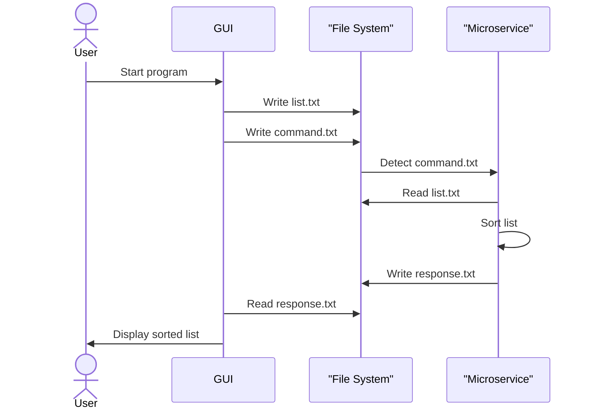

# Sort Microservice – Communication Contract

This microservice sorts a list of items either in **ascending (A–Z)** or **descending (Z–A)** order using a simple text file communication interface.

## How to Programmatically REQUEST Data

To request data from the microservice, your program must:

1. Write the list to be sorted to a file called `list.txt`, with **one item per line**.
2. Write the desired sort order (`asc` or `desc`) to a file called `command.txt`.

### Example (Python):
```python 
with open("list.txt", "w") as f: # This is where you write the data 
    f.write("Banana\n", "apple\n" + "carrot\n")

with open("command.txt", "w") as f: # you are in charge of updating this for the needs of your program
    f.write("asc")  # or "desc"
```

##  How to Programmatically RECEIVE Data

Once the microservice processes the sort request, it writes the sorted list to `response.txt`, one item per line. Your program should read from this file after waiting briefly for the response.

### Example (Python):
```python
import time

# Wait until response.txt contains actual data (non-empty)
while True:
    with open("response.txt", "r") as f:
        content = f.read()
    if content.strip():
        break
    time.sleep(0.5)

# Read and parse the sorted list, ignoring blank lines
with open("response.txt", "r") as f:
    sorted_list = [line.strip() for line in f if line.strip()]
print(sorted_list)
```

## UML Sequence Diagram: Request & Response Flow


## Notes
- The microservice continuously monitors `command.txt` for changes.
- You are responsible for generating `list.txt` and `command.txt` from your own code.
- The result appears in `response.txt`. Make sure to wait or check before reading it.

If you have questions, contact the developer before changing anything about the communication format.
